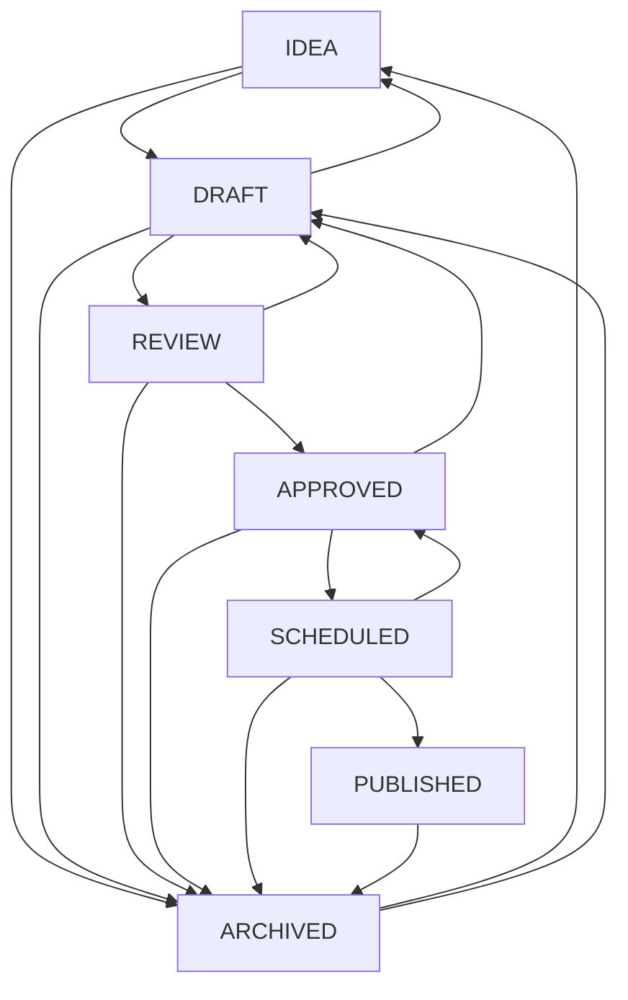
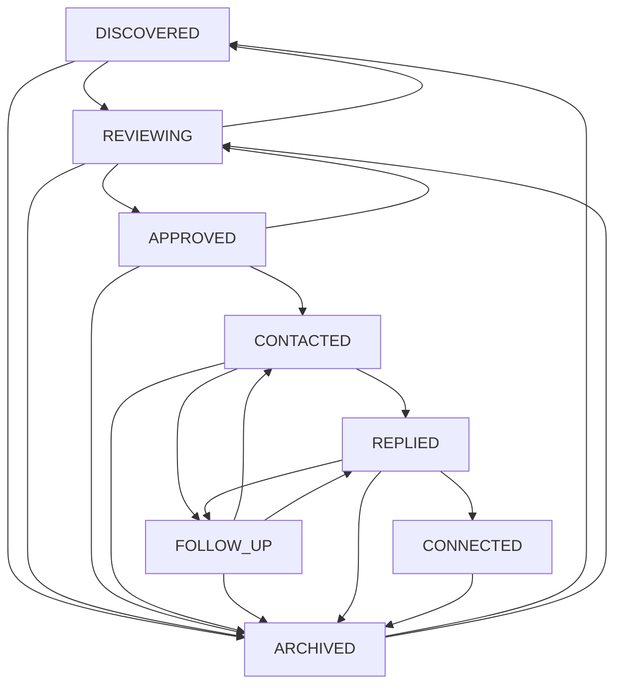
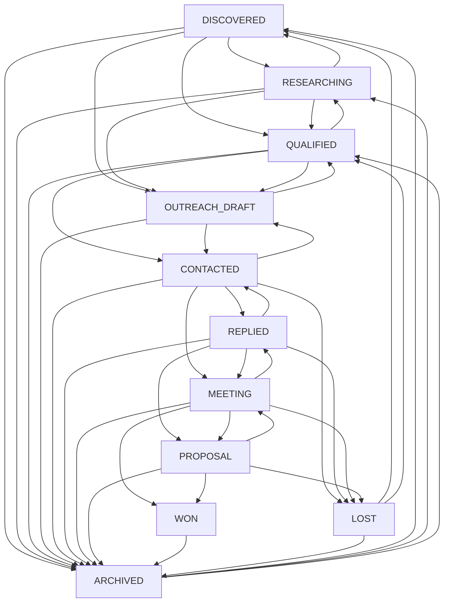

# System Architecture & Design

## 1. Core Operating Philosophy: Human-in-the-Loop (HITL)

The **LinkedIn Growth Automation Assistant** is designed around strictly compliant human-in-the-loop workflows:

### Networking Workflow:
```
DISCOVER ➔ REVIEW ➔ APPROVE ➔ DRAFT MESSAGE ➔ USER REVIEWS ➔ USER MANUALLY CONTACTS ➔ CONTACTED ➔ REPLIED / FOLLOW-UP ➔ CONNECTED / ARCHIVED
```

### Content Engine Workflow:
```
IDEA ➔ DRAFT ➔ REVIEW ➔ APPROVED ➔ SCHEDULED ➔ PUBLISHED ➔ ANALYTICS
```

### Safety & Compliance Guardrails:
- **No Unauthorized Scraping**: We do not scrape LinkedIn pages using headless browsers or synthetic sessions.
- **No Credential Storage**: We never request, store, or accept LinkedIn passwords or session cookies.
- **No Automated Publishing or Actions**: Mass connection requests, automated likes/comments, bot messaging, and automatic post publishing are strictly prohibited.
- **Manual Gatekeeping**: Content scheduling and outreach drafts are queued for manual user review and sending directly on LinkedIn. Internal scheduling creates reminders and calendar views—it does **NOT** post to LinkedIn on your behalf.

---

## 2. Content Engine Architecture (Phase 3)

### State Machine Transitions
The Content Engine implements a deterministic transition map to prevent invalid jumps:



Any attempt to execute an invalid transition (e.g., `IDEA -> PUBLISHED`, `DRAFT -> PUBLISHED`, or `ARCHIVED -> SCHEDULED`) is blocked at both the API level (HTTP 400 with a detailed error payload) and the UI level (only valid transition buttons are rendered).

### Content Versioning & Non-Destructive Regeneration
- Every content update or AI regeneration creates a record in the `ContentRevision` table (`id`, `contentPostId`, `title`, `hook`, `body`, `cta`, `hashtags`, `revisionNumber`, `createdAt`, `createdBy`).
- When regenerating content via `POST /api/content/:id/regenerate`, the existing draft is preserved while presenting a side-by-side comparison modal (`Current Version` vs `New Generated Candidate`) allowing the user to explicitly accept or discard the new version.

### Content Metrics & Multi-Snapshot Tracking
- Post performance is tracked in the `ContentMetric` table with timestamped snapshots (`recordedAt`).
- Each snapshot records `impressions`, `reactions`, `comments`, `reposts`, `clicks`, `followersAtPublication`, and auto-calculates `engagementRate` using the transparent shared formula.
- Multiple snapshots per post allow tracking reach velocity (e.g., 24h, 48h, 7-day post growth).

### Manual Publishing Workflow
1. When a post reaches `SCHEDULED`, it displays `SCHEDULED — MANUAL PUBLISH REQUIRED`.
2. The user clicks **Open LinkedIn** to open the official LinkedIn post creation interface in a new tab.
3. After manually submitting the post on LinkedIn, the user clicks **Mark as Published** and optionally provides the official post URL.
4. The post transitions to `PUBLISHED` and logs `publishedAt` and `publishedManually = true`.

---

## 3. Networking Pipeline Architecture (Phase 2)

### State Machine Transitions


### AI Outreach Drafting & Provenance Tracking
1. Structured context (`name`, `role`, `company`, `headline`, `relevanceReason`, `notes`, `category`) is provided to the AI provider.
2. The AI provider generates a concise draft ($\le 300$ characters) grounded strictly in verified profile facts.
3. The output includes explicit `personalizationBasis` tags (e.g. `['Role', 'Company', 'RelevanceReason']`).
4. If insufficient profile details are provided, `isLimitedPersonalization: true` is flagged, and the draft avoids fabricating shared connections, universities, or mutual acquaintances.
5. All drafts are stored in `NetworkingMessage` table with status `DRAFT`.
6. UI explicitly labels drafts: *"Draft only — review and send manually on LinkedIn."*

---

## 4. Analytics Engine Architecture (Phase 4)

### Data Provenance & Grounding Principles
The Analytics Engine aggregates metrics strictly from local PostgreSQL records created through manual user logging and verified lifecycle transitions:
- **Zero LinkedIn Scraping or API Impersonation**: All post reach numbers (impressions, reactions, comments, reposts, clicks) originate from explicit, user-entered `ContentMetric` snapshots.
- **No Arbitrary "Growth Scores"**: The engine produces explainable, deterministic mathematical metrics and transparent period-over-period comparisons rather than black-box AI scores.
- **No Fabrication**: If data is missing (e.g. 0 impressions or unrecorded responses), metrics safely return `null` or `0` rather than estimating or inventing values.

### Time-Series Bucketing & Period Comparison Logic
1. **Contiguous Period Bounds (`getDateRangeForPeriod`)**: Computes exact `startDate` and `endDate` boundaries for `7d`, `30d`, `90d`, `1y`, or `custom` ranges.
2. **Equal-Duration Preceding Baseline**: Concurrently calculates an equal-length baseline period (`prevStartDate` to `prevEndDate`) immediately preceding the current period window for period-over-period delta comparisons.
3. **Aggregation Bucketing (`formatBucketKey`)**: Groups timeline metrics by `day` (`YYYY-MM-DD`), `week` (`YYYY-MM-DD` starting on Monday), or `month` (`YYYY-MM`).
4. **Timezone-Safe Date Keys**: Date keys are extracted using local calendar date formatting (`formatDateKey`) to avoid off-by-one shifts caused by UTC conversions.

### Deterministic Insights Engine
The `generateDeterministicInsights` function synthesizes rule-based findings directly from mathematical deltas:
- **Reach Trends**: Identifies percentage changes in reach compared against baseline.
- **Top Topics**: Identifies highest-engagement content categories with exact average engagement rates.
- **Follow-Up Warnings**: Flags active follow-up counts requiring user attention.
- **Pipeline Activity**: Summarizes qualified leads and upcoming internship deadlines within 14 days.

---

## 5. Lead Generation & Freelance Outreach Engine Architecture (Phase 5)

### State Machine Transitions
The Lead Pipeline enforces explicit lifecycle progression across 11 states:



### Deterministic Lead Opportunity & Qualification Heuristic
Lead scoring is computed 100% deterministically using `calculateLeadQualification()` without external AI hallucinations:
- **Technical Opportunity Component (max 80 points)**:
  - Conversion & CTA Clarity ($30\%$): $(10 - \text{cta}) \times 1.5 + (10 - \text{conversion}) \times 1.5$ (max 30 pts)
  - Mobile & Performance ($30\%$): $(10 - \text{mobile}) \times 1.5 + (10 - \text{perf}) \times 1.5$ (max 30 pts)
  - Website UX & Visuals ($20\%$): $(10 - \text{visual}) \times 1.0 + (10 - \text{ux}) \times 1.0$ (max 20 pts)
- **Service Fit Points ($20\%$)**: `HIGH` = 20 pts, `MEDIUM` = 12 pts, `LOW` = 4 pts.
- **Total Qualification Score**: Sum of technical opportunity points + service fit points, clamped between 0 and 100.
- **Transparent Reasons**: The calculation generates human-readable diagnostic reasons for each dimension below 6/10.

### Grounded AI Outreach Drafting with Multi-Length Variants
1. The AI provider is prompted with verified lead facts (`company`, `website`, `industry`, `location`, `contactName`, `contactRole`, `problem`, `opportunity`, `auditReasons`, `serviceFit`).
2. Generates 3 distinct grounded variants:
   - **`CONNECTION`**: Ultra-short connection request note ($\le 300$ characters).
   - **`SHORT`**: Concise value pitch email/DM (500–800 characters) offering a 3-minute Loom video breakdown.
   - **`DETAILED`**: Comprehensive consultative outreach (800–1200 characters) referencing observed friction points and proposed solutions.
3. Every draft includes explicit `personalizationBasis` citations.
4. The output is validated strictly with Zod (`generateLeadOutreachOutputSchema`).

### Manual Action & Human-in-the-Loop Interaction History
- The application never sends emails or LinkedIn messages directly.
- The UI provides copy actions, editable textareas, and direct external LinkedIn launchers.
- User touchpoints are recorded via `LeadInteraction` (`NOTE`, `EMAIL`, `CALL`, `MEETING`, `LINKEDIN_MANUAL`, `OTHER`).
- Scheduling follow-ups computes deterministic urgency badges (`OVERDUE`, `DUE_TODAY`, `UPCOMING_7_DAYS`, `FUTURE`, `NONE`).

---

## 6. Monorepo Structure

```
root/
├── apps/
│   ├── web/                     # React 18 + Vite + Tailwind CSS + Lucide Icons + SVG Charts
│   └── api/                     # Node.js + Express 5 + TypeScript + Zod + Prisma
│
├── packages/
│   ├── shared/                  # Domain types, Enums, Zod schemas, calculations, transition maps
│   └── database/                # Prisma ORM schema, PostgreSQL migrations, seeding
│
├── docs/                        # Architecture, API & Safety documentation
├── docker-compose.yml           # Local PostgreSQL 16 container
└── package.json                 # Monorepo workspaces
```

---

## 6. Data Storage & Ownership

LinkedIn is **not** the application database. The application maintains an independent, structured database tracking:
1. **Content CMS**: Technical post ideas, hooks, body drafts, approval status, internal schedule dates, revision history, and performance metric snapshots.
2. **Networking Contacts & Messages**: Relevance reasons, category tags, last interaction timestamps, follow-up queues, personalized drafts, and message version history.
3. **Freelance Leads**: Website audit observations, transparent qualification breakdowns (UX, Mobile, Performance, CTA, Conversion), service fit, personalized value pitches.
4. **Internship Intelligence**: Official company career openings, eligibility requirements, deadline alerts, skill matches.
5. **Growth Analytics**: Daily follower, connection, impression, interaction, and engagement rate snapshots.

---

## 7. Transparent Scoring Formulas

### Engagement Rate:
$$\text{Engagement Rate (\%)} = \frac{\text{Reactions} + \text{Comments} + \text{Reposts} + \text{Clicks}}{\text{Impressions}} \times 100$$
*Returns `null` when Impressions $\le 0$ to prevent division by zero.*

### Period-over-Period Percentage Change:
$$\text{Percentage Change (\%)} = \frac{\text{Current Value} - \text{Previous Value}}{\text{Previous Value}} \times 100$$
*Returns `0` when both values are 0; returns `null` when Previous is 0 and Current > 0.*

### Lead Qualification Scoring:
Calculated deterministically from explicit audit factors (UX, Mobile Responsiveness, Page Speed, CTA Visibility, Funnel Friction) and weighted service fit.
