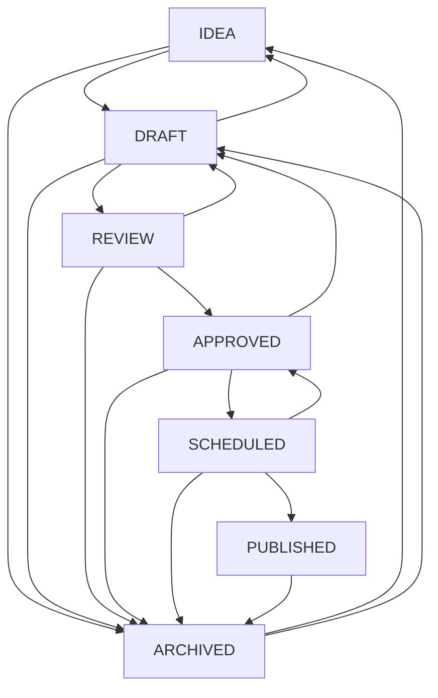
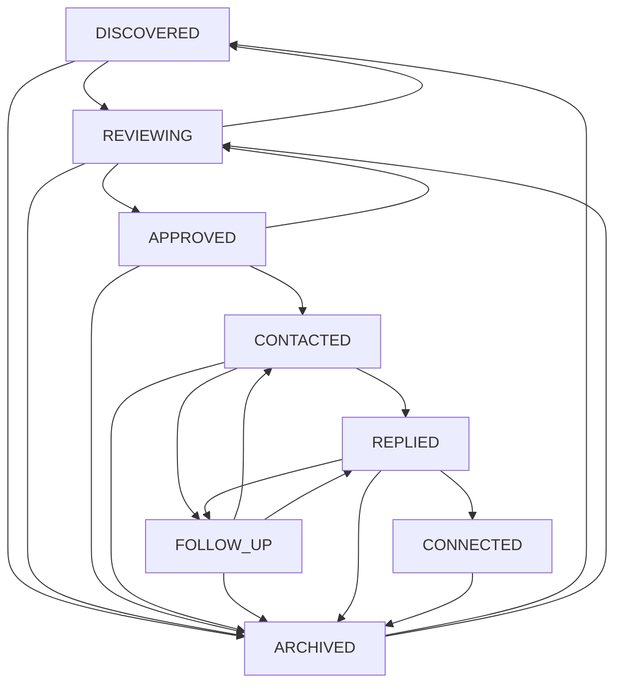

# System Architecture & Design

## 1. Core Operating Philosophy: Human-in-the-Loop (HITL)

The **LinkedIn Growth Automation Assistant** is designed around strictly compliant human-in-the-loop workflows:

### Networking Workflow:
```
DISCOVER ➔ REVIEW ➔ APPROVE ➔ DRAFT MESSAGE ➔ USER REVIEWS ➔ USER MANUALLY CONTACTS ➔ CONTACTED ➔ REPLIED / FOLLOW-UP ➔ CONNECTED / ARCHIVED
```

### Content Engine Workflow:
```
IDEA ➔ DRAFT ➔ REVIEW ➔ APPROVED ➔ SCHEDULED ➔ PUBLISHED ➔ ANALYTICS
```

### Safety & Compliance Guardrails:
- **No Unauthorized Scraping**: We do not scrape LinkedIn pages using headless browsers or synthetic sessions.
- **No Credential Storage**: We never request, store, or accept LinkedIn passwords or session cookies.
- **No Automated Publishing or Actions**: Mass connection requests, automated likes/comments, bot messaging, and automatic post publishing are strictly prohibited.
- **Manual Gatekeeping**: Content scheduling and outreach drafts are queued for manual user review and sending directly on LinkedIn. Internal scheduling creates reminders and calendar views—it does **NOT** post to LinkedIn on your behalf.

---

## 2. Content Engine Architecture (Phase 3)

### State Machine Transitions
The Content Engine implements a deterministic transition map to prevent invalid jumps:



Any attempt to execute an invalid transition (e.g., `IDEA -> PUBLISHED`, `DRAFT -> PUBLISHED`, or `ARCHIVED -> SCHEDULED`) is blocked at both the API level (HTTP 400 with a detailed error payload) and the UI level (only valid transition buttons are rendered).

### Content Versioning & Non-Destructive Regeneration
- Every content update or AI regeneration creates a record in the `ContentRevision` table (`id`, `contentPostId`, `title`, `hook`, `body`, `cta`, `hashtags`, `revisionNumber`, `createdAt`, `createdBy`).
- When regenerating content via `POST /api/content/:id/regenerate`, the existing draft is preserved while presenting a side-by-side comparison modal (`Current Version` vs `New Generated Candidate`) allowing the user to explicitly accept or discard the new version.

### Content Metrics & Multi-Snapshot Tracking
- Post performance is tracked in the `ContentMetric` table with timestamped snapshots (`recordedAt`).
- Each snapshot records `impressions`, `reactions`, `comments`, `reposts`, `clicks`, `followersAtPublication`, and auto-calculates `engagementRate` using the transparent shared formula.
- Multiple snapshots per post allow tracking reach velocity (e.g., 24h, 48h, 7-day post growth).

### Manual Publishing Workflow
1. When a post reaches `SCHEDULED`, it displays `SCHEDULED — MANUAL PUBLISH REQUIRED`.
2. The user clicks **Open LinkedIn** to open the official LinkedIn post creation interface in a new tab.
3. After manually submitting the post on LinkedIn, the user clicks **Mark as Published** and optionally provides the official post URL.
4. The post transitions to `PUBLISHED` and logs `publishedAt` and `publishedManually = true`.

---

## 3. Networking Pipeline Architecture (Phase 2)

### State Machine Transitions


### AI Outreach Drafting & Provenance Tracking
1. Structured context (`name`, `role`, `company`, `headline`, `relevanceReason`, `notes`, `category`) is provided to the AI provider.
2. The AI provider generates a concise draft ($\le 300$ characters) grounded strictly in verified profile facts.
3. The output includes explicit `personalizationBasis` tags (e.g. `['Role', 'Company', 'RelevanceReason']`).
4. If insufficient profile details are provided, `isLimitedPersonalization: true` is flagged, and the draft avoids fabricating shared connections, universities, or mutual acquaintances.
5. All drafts are stored in `NetworkingMessage` table with status `DRAFT`.
6. UI explicitly labels drafts: *"Draft only — review and send manually on LinkedIn."*

---

## 4. Monorepo Structure

```
root/
├── apps/
│   ├── web/                     # React 18 + Vite + Tailwind CSS + Lucide Icons
│   └── api/                     # Node.js + Express 5 + TypeScript + Zod + Prisma
│
├── packages/
│   ├── shared/                  # Domain types, Enums, Zod schemas, calculations, transition maps
│   └── database/                # Prisma ORM schema, PostgreSQL migrations, seeding
│
├── docs/                        # Architecture, API & Safety documentation
├── docker-compose.yml           # Local PostgreSQL 16 container
└── package.json                 # Monorepo workspaces
```

---

## 5. Data Storage & Ownership

LinkedIn is **not** the application database. The application maintains an independent, structured database tracking:
1. **Content CMS**: Technical post ideas, hooks, body drafts, approval status, internal schedule dates, revision history, and performance metric snapshots.
2. **Networking Contacts & Messages**: Relevance reasons, category tags, last interaction timestamps, follow-up queues, personalized drafts, and message version history.
3. **Freelance Leads**: Website audit observations, transparent qualification breakdowns (UX, Mobile, Performance, CTA, Conversion), service fit, personalized value pitches.
4. **Internship Intelligence**: Official company career openings, eligibility requirements, deadline alerts, skill matches.
5. **Growth Analytics**: Daily follower, connection, impression, interaction, and engagement rate snapshots.

---

## 6. Transparent Scoring Formulas

### Engagement Rate:
$$\text{Engagement Rate (\%)} = \frac{\text{Reactions} + \text{Comments} + \text{Reposts} + \text{Clicks}}{\text{Impressions}} \times 100$$
*Returns `null` when Impressions $\le 0$ to prevent division by zero.*

### Lead Qualification Scoring:
Calculated deterministically from explicit audit factors (UX, Mobile Responsiveness, Page Speed, CTA Visibility, Funnel Friction) and weighted service fit.
